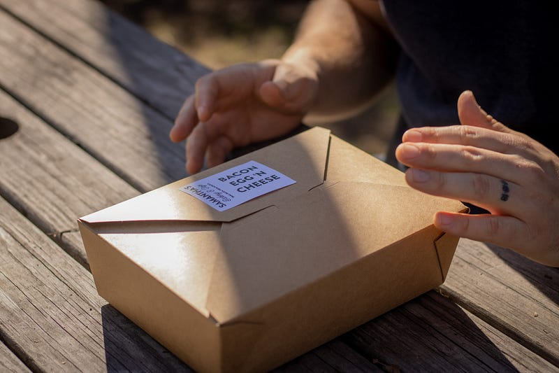

<!--  -->

 今天在吃午餐時一邊想著鍾愛的瀏覽器，一邊等著我的午餐餐盒，突然想到如果我是餐盒老闆，我會怎麼優化這整個流程（好的我可能真的走火入魔了而目的是讓客人可以更快速地拿到餐盒

 然而想著想著，突然發現．．．．

##### **這不就是SSR嗎！！！**

 接著自己就笑了出來，好似自己看到了什麼宇宙的奧妙一樣，殊不知，老闆娘同時也在斜眼看著我，老闆娘ＯＳ：這工程師瘋了吧？
   
 
 好的這就是前言。以下正式開始午餐餐盒之旅：

 先假設我們是午餐餐盒的老闆（或老闆娘），一般的方式都是客人來，客人告訴你他想吃什麼，這時你有三種方式：

 第一種就是，最快的方式，來帥哥～你把這些米啊，肉啊，菜阿帶回去，啊回去自己組裝喔，其實這也是一個餐盒啦，只是我沒幫你裝好而已，你回去自己弄（當然前提客人沒有傻眼），這其實就是  **CSR** ，**Client Side Rendering**，我給你食材，你自己帶回家處理，啾咪。

 而想必第一種應該現實中很快這家店就會倒閉了XD 這帶我們來到第二種方式，現點現做，我餐廳什麼都不做，我只先處理好食材，但我會等你說好要什麼，那我在現場開始組裝跟裝盤，而這就是**SSR** ，**Server Side Rendering**，顧名思義，你說說要的同時，也就是請求發出時，我在開始裝盤跟製作，這也是現在大部分餐廳的運作模式，對於客戶來說，體驗不夠好，因為有時候很快有時候很慢，要看你有沒有很忙（請求過多），所以，就出現了第三種模式。

 第三種模式，我們叫它**SSG，Static Side Generation，聽起來很高大上很厲害對不對，但他其實只是，先做好餐盒而已，或者更精細的說，他先做好一定會用到的部分，舉例來說：一般客人絕大多數都會點餐盒，而餐盒有什麼是一定會有的，也就是米飯，小菜，跟包裝，只是主菜在做變化而已，那何不，我們先做好一定會有的部分呢？先裝好放好，只是主菜不放，等客人請求發出時：欸我要一個雞胸肉餐盒喔，在動態的放上雞胸肉餐盒，馬上出貨客人開心，餐廳也順利地解決一個請求，但，這需要什麼？ 這需要餐廳好好思考，思考及優化整個過程，才能知道什麼東西不用改，什麼東西需要動態做變化。**

 **好了以上就是關於 CSR、SSR 與 SSG 的簡短生平，這樣理解會不會更平易近人呢？**